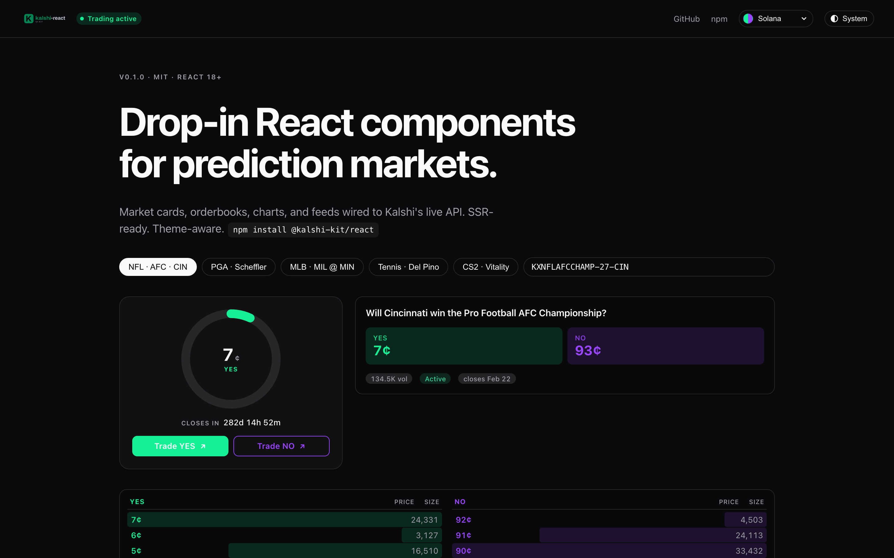
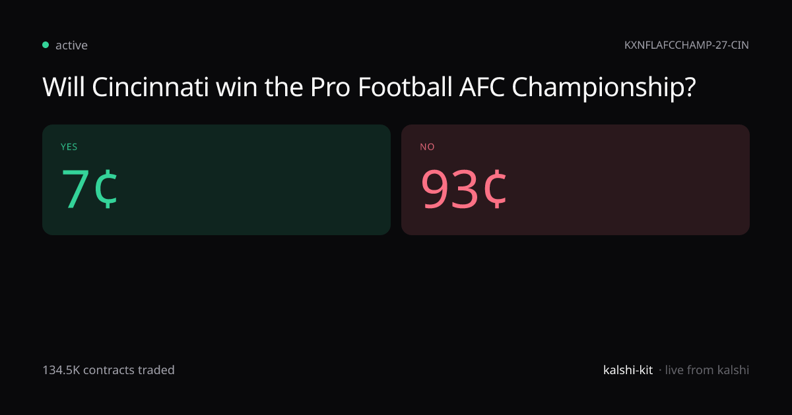

<p align="center">
  
</p>

<p align="center">
  Drop-in React components for <a href="https://kalshi.com">Kalshi</a> prediction markets.
</p>

<p align="center">
  <a href="https://www.npmjs.com/package/@kalshi-kit/react"></a>
  <a href="https://www.npmjs.com/package/@kalshi-kit/next"></a>
  <a href="https://kalshi-kit.dev"></a>
  <a href="./LICENSE"></a>
  <a href="https://bundlephobia.com/package/@kalshi-kit/react"></a>
</p>

<p align="center">
  <a href="https://kalshi-kit.dev">
    
  </a>
</p>

## Install

```bash
npm install @kalshi-kit/react @kalshi-kit/next
```

## Use

```js
// next.config.mjs
import { withKalshi } from "@kalshi-kit/next";
export default withKalshi();
```

```tsx
import { MarketCard } from "@kalshi-kit/react";
import "@kalshi-kit/react/styles.css";

export default function Page() {
  return <MarketCard ticker="KXNBA-26MAY15DETCLE" />;
}
```

The Next.js helper proxies `/api/kalshi/*` on the server so the browser stays inside its own origin. No API key needed for public market data.

## Live preview

A live OG-image endpoint at `kalshi-kit.dev/api/og/market/[ticker]` renders any Kalshi market as a PNG (1200x630) for embeds and OG cards. Sample below:

<p align="center">
  
</p>

## Components

| Component | Renders |
| --- | --- |
| `MarketCard` | YES/NO prices, volume, status, close time |
| `Orderbook` | Stacked or split YES/NO levels with size bars |
| `CandlestickChart` | OHLC chart backed by `lightweight-charts` |
| `TradeFeed` | Live trade tape |
| `ProbabilityDial` | Circular gauge for YES probability |
| `CountdownTimer` | Live countdown to market close |
| `TimeRangeSelector` | 1h / 1d / 1w / 1m / All |
| `TradeButton` | Deep-link to kalshi.com with optional builder code |
| `WatchlistButton` | localStorage-backed star toggle |
| `ShareCard` | Copy-link and tweet buttons |
| `EventSearch` | Debounced autocomplete over live events |
| `CategoryFilter` | Category pill row |
| `EventCard` | Header for a multi-outcome event |
| `EventMarketList` | Ranked child markets with probability bars |
| `MarketSparkline` | Inline SVG mini-chart |
| `ExchangeStatusBadge` | Trading status pill |

Every component takes an optional `data` prop so a parent can fetch once and fan it out.

## Hooks

`useMarket`, `useOrderbook`, `useCandlesticks`, `useTrades`, `useExchangeStatus`, `useEvent`, `useEventSearch`, `useWatchlist`, `usePolledResource`.

## Theming

```tsx
import { KalshiProvider } from "@kalshi-kit/react";

<KalshiProvider theme="dark">{children}</KalshiProvider>
```

`theme` accepts `"light"`, `"dark"`, or `"system"`. Per-instance color overrides:

```tsx
<MarketCard ticker="..." colors={{ yes: "#3b82f6", no: "#eab308" }} />
```

## Demo

[kalshi-kit.dev](https://kalshi-kit.dev)

## Packages

- [`@kalshi-kit/react`](./packages/react)
- [`@kalshi-kit/next`](./packages/next)

## License

MIT
